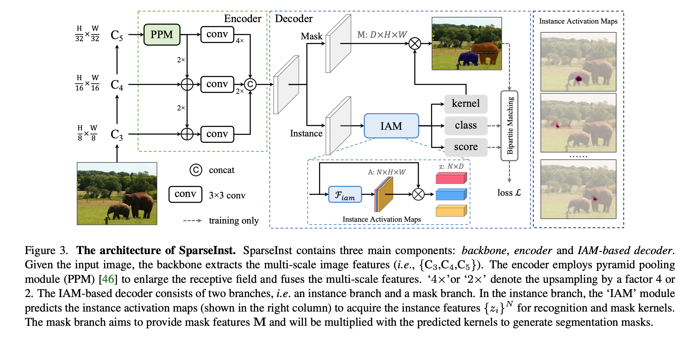
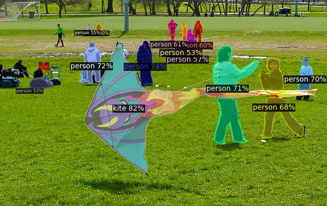

<div align="center">
<h1>SparseInst &#128640;</h1>
<span><font size="4", >A simple framework for real-time instance segmentation, CVPR 2022</font></span>
</br>
by
<br>
Tianheng Cheng, <a href="https://xinggangw.info/">Xinggang Wang</a><sup><span>&#8224;</span></sup>, Shaoyu Chen, Wenqiang Zhang, <a href="https://scholar.google.com/citations?user=pCY-bikAAAAJ&hl=zh-CN">Qian Zhang</a>, <a href="https://scholar.google.com/citations?user=IyyEKyIAAAAJ&hl=zh-CN">Chang Huang</a>, <a href="https://zhaoxiangzhang.net/">Zhaoxiang Zhang</a>, <a href="http://eic.hust.edu.cn/professor/liuwenyu/"> Wenyu Liu</a>
</br>
(<span>&#8224;</span>: corresponding author)

<!-- <div><a href="">[Project Page]</a>(comming soon)</div>  -->
<div><a href="https://arxiv.org/abs/2203.12827">[Paper]</a></div>

</div>


## Highlights 

<div align="center">

<br>
<br>
<div>

[](https://paperswithcode.com/sota/real-time-instance-segmentation-on-mscoco?p=sparse-instance-activation-for-real-time)
</div>
</div>


* SparseInst presents a new object representation method, *i.e.*, Instance Activation Maps (IAM), to adaptively highlight informative regions of objects for recognition.
* SparseInst is a simple, efficient, and fully convolutional framework without non-maximum suppression (NMS) or sorting, and easy to deploy!
* SparseInst achieves good trade-off between speed and accuracy, *e.g.*, 37.9 AP and 40 FPS with 608x input.


## Updates

`This project is under active development, please stay tuned!` &#9749;

* **[2022-4-29]:** We fix the **common issue** about the visualization `demo.py`, *e.g.,* `ValueError: GenericMask cannot handle ...`. 

* **[2022-4-7]:** We provide the `demo` code for visualization and inference on images. Besides, we have added more backbones for SparseInst, including [ResNet-101](https://arxiv.org/abs/1512.03385), [CSPDarkNet](https://arxiv.org/pdf/2004.10934v1.pdf), and [PvTv2](https://arxiv.org/abs/2102.12122). We are still supporting more backbones.

* **[2022-3-25]:** We have released the code and models for SparseInst! 

 

## Overview
**SparseInst** is a conceptually novel, efficient, and fully convolutional framework for real-time instance segmentation.
In contrast to region boxes or anchors (centers), SparseInst adopts a sparse set of **instance activation maps** as object representation, to highlight informative regions for each foreground objects.
Then it obtains the instance-level features by aggregating features according to the highlighted regions for recognition and segmentation.
The bipartite matching compels the instance activation maps to predict objects in a one-to-one style, thus avoiding non-maximum suppression (NMS) in post-processing. Owing to the simple yet effective designs with instance activation maps, SparseInst has extremely fast inference speed and achieves **40 FPS** and **37.9 AP** on COCO (NVIDIA 2080Ti), significantly outperforms the counter parts in terms of speed and accuracy.


<center>

</center>


## Models

We provide two versions of SparseInst, *i.e.*, the basic IAM (3x3 convolution) and the Group IAM (G-IAM for short), with different backbones.
All models are trained on MS-COCO *train2017*.

#### Fast models

| model | backbone | input | aug | AP<sup>val</sup> |  AP  | FPS | weights |
| :---- | :------  | :---: | :-: |:--------------: | :--: | :-: | :-----: |
| [SparseInst](configs/sparse_inst_r50_base.yaml) | [R-50]() | 640 | &#x2718; | 32.8 | 33.2 | 44.3 | [model](https://drive.google.com/file/d/12RQLHD5EZKIOvlqW3avUCeYjFG1NPKDy/view?usp=sharing) |
| [SparseInst](sparse_inst_r50vd_base.yaml) | [R-50-vd](https://github.com/rwightman/pytorch-image-models/releases/download/v0.1-weights/resnet50d_ra2-464e36ba.pth) | 640 | &#x2718; | 34.1 | 34.5 | 42.6 | [model](https://drive.google.com/file/d/1fjPFy35X2iJu3tYwVdAq4Bel82PfH5kx/view?usp=sharing)|
| [SparseInst (G-IAM)](configs/sparse_inst_r50_giam.yaml) | [R-50]() | 608 | &#x2718; | 33.4 | 34.0 | 44.6 | [model](https://drive.google.com/file/d/1pXU7Dsa1L7nUiLU9ULG2F6Pl5m5NEguL/view?usp=sharing) |
| [SparseInst (G-IAM)](configs/sparse_inst_r50_giam_aug.yaml) | [R-50]() | 608 | &#10003; | 34.2 | 34.7 | 44.6 | [model](https://drive.google.com/file/d/1MK8rO3qtA7vN9KVSBdp0VvZHCNq8-bvz/view?usp=sharing) |
| [SparseInst (G-IAM)](configs/sparse_inst_r50_dcn_giam_aug.yaml) | [R-50-DCN]() | 608 | &#10003;| 36.4 | 36.8 | 41.6 | [model](https://drive.google.com/file/d/1qxdLRRHbIWEwRYn-NPPeCCk6fhBjc946/view?usp=sharing) |
| [SparseInst (G-IAM)](configs/sparse_inst_r50vd_giam_aug.yaml) | [R-50-vd](https://github.com/rwightman/pytorch-image-models/releases/download/v0.1-weights/resnet50d_ra2-464e36ba.pth) | 608 | &#10003;| 35.6 | 36.1 | 42.8| [model](https://drive.google.com/file/d/1dlamg7ych_BdWpPUCuiBXbwE0SXpsfGx/view?usp=sharing) |
| [SparseInst (G-IAM)](configs/sparse_inst_r50vd_dcn_giam_aug.yaml) | [R-50-vd-DCN](https://github.com/rwightman/pytorch-image-models/releases/download/v0.1-weights/resnet50d_ra2-464e36ba.pth) | 608 | &#10003; | 37.4 | 37.9 | 40.0  | [model](https://drive.google.com/file/d/1clYPdCNrDNZLbmlAEJ7wjsrOLn1igOpT/view?usp=sharing)|
| [SparseInst (G-IAM)](configs/sparse_inst_r50vd_dcn_giam_aug.yaml) | [R-50-vd-DCN](https://github.com/rwightman/pytorch-image-models/releases/download/v0.1-weights/resnet50d_ra2-464e36ba.pth) | 640 | &#10003; | 37.7 | 38.1 | 39.3 |  [model](https://drive.google.com/file/d/1clYPdCNrDNZLbmlAEJ7wjsrOLn1igOpT/view?usp=sharing)| 

<!-- #### SparseInst with other backbones

| model | backbone | input | AP<sup>val</sup> |  AP  | FPS | weights |
| :---- | :------ | :---: | :--------------: | :--: | :-: | :-----: |
| SparseInst (G-IAM) | [VoVNet]() | 640 | - | - | - | [model]() |
| SparseInst (G-IAM) | [CSPDarkNet]() | 640 | - | -| - | [model]() |  -->

#### Larger models

| model | backbone | input | aug  | AP<sup>val</sup> |  AP  | FPS | weights |
| :---- | :------ | :---: | :---: | :--------------: | :--: | :-: | :-----: |
| [SparseInst (G-IAM)](configs/sparse_inst_r101_giam.yaml) | [R-101]() | 640 | &#x2718; | 34.9 | 35.5 | - | [model](https://drive.google.com/file/d/1EZZck-UNfom652iyDhdaGYbxS0MrO__z/view?usp=sharing)|
| [SparseInst (G-IAM)](configs/sparse_inst_r101_dcn_giam.yaml) | [R-101-DCN]() | 640 | &#x2718; | 36.4 | 36.9 | - | [model](https://drive.google.com/file/d/1shkFvyBmDlWRxl1ActD6VfZJTJYBGBjv/view?usp=sharing) |

#### SparseInst with Vision Transformers

| model | backbone | input | aug | AP<sup>val</sup> |  AP  | FPS | weights |
| :---- | :------ | :---: | :---: | :--------------: | :--: | :-: | :-----: |
| [SparseInst (G-IAM)](configs/sparse_inst_pvt_b1_giam.yaml) | [PVTv2-B1]() | 640 |  &#x2718; | 35.3 | 36.0 | 33.5 (48.9<sup>&#x021A1;</sup>)| [model](https://drive.google.com/file/d/13l9JgTz3sF6j3vSVHOOhAYJnCf-QuNe_/view?usp=sharing) |
| [SparseInst (G-IAM)](configs/sparse_inst_pvt_b2_li_giam.yaml) | [PVTv2-B2-li]() | 640 |  &#x2718; | 37.2 | 38.2 | 26.5 | [model](https://drive.google.com/file/d/1DFxQnFg_UL6kmMoNC4StUKo79RXVHyNF/view?usp=sharing) |

<sup>&#x021A1;</sup>: measured on RTX 3090.


**Note:** 
* **We will continue adding more models** including more efficient convolutional networks, vision transformers, and larger models for high performance and high speed, please stay tuned &#128513;!
* Inference speeds are measured on one NVIDIA 2080Ti unless specified.
* We haven't adopt TensorRT or other tools to accelerate the inference of SparseInst. However, we are working on it now and will provide support for ONNX, TensorRT, MindSpore, [Blade](https://github.com/alibaba/BladeDISC), and other frameworks as soon as possible!
* AP denotes AP evaluated on MS-COCO *test-dev2017*
* *input* denotes the shorter side of the input, *e.g.*, 512x864 and 608x864, we keep the aspect ratio of the input and the longer side is no more than 864.
* The inference speed might slightly change on different machines (2080 Ti) and different versions of detectron (we mainly use [v0.3](https://github.com/facebookresearch/detectron2/tree/v0.3)). If the change is sharp, e.g., > 5ms, please feel free to contact us.
* For `aug` (augmentation), we only adopt the simple random crop (crop size: [384, 600]) provided by detectron2.
* We adopt `weight decay=5e-2` as default setting, which is slightly different from the original paper.
* **[Weights on BaiduPan]**: we also provide trained models on BaiduPan: [ShareLink](https://pan.baidu.com/s/1tot7Wcoi4J1xh8ZS7VikZg) (password: lkdo).

## Installation and Prerequisites

This project is built upon the excellent framework [detectron2](https://github.com/facebookreseach/detectron2), and you should install detectron2 first, please check [official installation guide](https://detectron2.readthedocs.io/en/latest/tutorials/install.html) for more details.

**Note:** we mainly use [v0.3](https://github.com/facebookresearch/detectron2/tree/v0.3) of detectron2 for experiments and evaluations. Besides, we also test our code on the newest version [v0.6](https://github.com/facebookresearch/detectron2/tree/v0.6). If you find some bugs or incompatibility problems of higher version of detectron2, please feel free to raise a issue!

Install the detectron2:

```bash
git clone https://github.com/facebookresearch/detectron2.git
# if you swith to a specific version, e.g., v0.3 (recommended)
git checkout tags/v0.3
# build detectron2
python setup.py build develop
```

## Getting Start


### Testing SparseInst

Before testing, you should specify the config file `<CONFIG>` and the model weights `<MODEL-PATH>`. In addition, you can change the input size by setting the `INPUT.MIN_SIZE_TEST` in both config file or commandline.

* [Performance Evaluation] To obtain the evaluation results, *e.g.*, mask AP on COCO, you can run:

```bash
python train_net.py --config-file <CONFIG> --num-gpus <GPUS> --eval MODEL.WEIGHTS <MODEL-PATH>
# example:
python train_net.py --config-file configs/sparse_inst_r50_giam.yaml --num-gpus 8 --eval MODEL.WEIGHTS sparse_inst_r50_giam_aug_2b7d68.pth
```

* [Inference Speed] To obtain the inference speed (FPS) on one GPU device, you can run:

```bash
python test_net.py --config-file <CONFIG> MODEL.WEIGHTS <MODEL-PATH> INPUT.MIN_SIZE_TEST 512
# example:
python test_net.py --config-file configs/sparse_inst_r50_giam.yaml MODEL.WEIGHTS sparse_inst_r50_giam_aug_2b7d68.pth INPUT.MIN_SIZE_TEST 512
```

**Note:** 
* The `test_net.py` only supports **1 GPU** and **1 image per batch** for measuring inference speed.
* The inference time consists of the *pure forward time* and the *post-processing time*. While the evaluation processing, data loading, and pre-processing for wrappers (*e.g.*, ImageList) are not included.
* `COCOMaskEvaluator` is modified from [`COCOEvaluator`](https://github.com/facebookresearch/detectron2/blob/main/detectron2/evaluation/coco_evaluation.py) for evaluating mask-only results.

### Visualizing Images with SparseInst

To inference or visualize the segmentation results on your images, you can run:

```bash
python demo.py --config-file <CONFIG> --input <IMAGE-PATH> --output results --opts MODEL.WEIGHTS <MODEL-PATH>
# example
python demo.py --config-file configs/sparse_inst_r50_giam.yaml --input datasets/coco/val2017/* --output results --opt MODEL.WEIGHTS sparse_inst_r50_giam_aug_2b7d68.pth INPUT.MIN_SIZE_TEST 512
```
* Besides, the `demo.py` also supports inference on video (`--video-input`), camera (`--webcam`). For inference on video, you might refer to [issue #9](https://github.com/hustvl/SparseInst/issues/9) to avoid someerrors.
* `--opts` supports modifications to the config-file, *e.g.,* `INPUT.MIN_SIZE_TEST 512`.
* `--input` can be single image or a folder of images, *e.g.,* `xxx/*`.
* If `--output` is not specified, a popup window will show the visualization results for each image.
* Lowering the `confidence-threshold` will show more instances but with more false positives.

<div>
<table align="center">
<td></td>
<td></td>
</table>
<span><p align="center">Visualization results (SparseInst-R50-GIAM)</p></span>
</div>


### Training SparseInst

To train the SparseInst model on COCO dataset with 8 GPUs. 8 GPUs are required for the training. If you only have 4 GPUs or GPU memory is limited, it doesn't matter and you can reduce the batch size through `SOLVER.IMS_PER_BATCH` or reduce the input size. If you adjust the batch size, learning schedule should be adjusted according to the linear scaling rule.

```bash
python train_net.py --config-file <CONFIG> --num-gpus 8 
# example
python train_net.py --config-file configs/sparse_inst_r50vd_dcn_giam_aug.yaml --num-gpus 8
```


## Acknowledgements


SparseInst is based on [detectron2](https://github.com/facebookresearch/detectron2), [OneNet](https://github.com/PeizeSun/OneNet), [DETR](https://github.com/facebookresearch/detr), and [timm](https://github.com/rwightman/pytorch-image-models), and we sincerely thanks for their code and contribution to the community!


## Citing SparseInst

If you find SparseInst is useful in your research or applications, please consider giving us a star &#127775; and citing SparseInst by the following BibTeX entry.

```BibTeX
@inproceedings{Cheng2022SparseInst,
  title     =   {Sparse Instance Activation for Real-Time Instance Segmentation},
  author    =   {Cheng, Tianheng and Wang, Xinggang and Chen, Shaoyu and Zhang, Wenqiang and Zhang, Qian and Huang, Chang and Zhang, Zhaoxiang and Liu, Wenyu},
  booktitle =   {Proc. IEEE Conf. Computer Vision and Pattern Recognition (CVPR)},
  year      =   {2022}
}

```


## License

SparseInst is released under the [MIT Licence](LICENCE).
